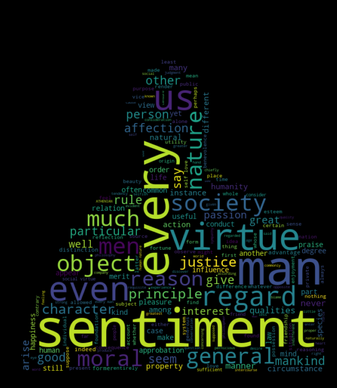
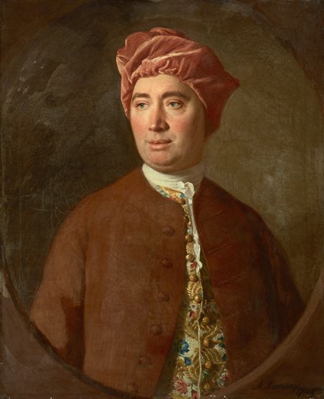
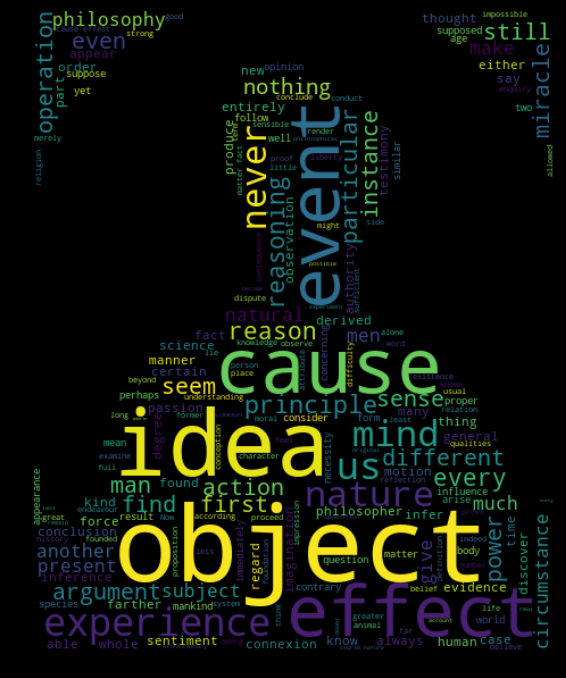

# David Hume Word Clouds

This repository contains texts, images, and a Jupyter notebook for generating word clouds
for the following of David Hume's works:

  1. Enquiry into Human Understanding (EHU)
  2. Enquiry into the Principles of Morals (EPM)
  3. Treatise on Human Nature, Book 1
  4. Treatise on Human Nature, Book 2

All of these works are in the public domain according to Wikipedia.
In addition, the photographs of the two portraits of Hume are in the
public domain in the United States per Wikipedia.

For generation of the word clouds, see [hume_word_clouds.ipynb](hume_word_clouds.ipynb).

The .XCF files in the images folder can be opened in GIMP.

## Examples

EPM:

<table>
  <tr>
  <td></td>
  <td></td>
  </tr>
</table>

EHU:

<table>
  <tr>
  <td></td>
  <td></td>
  </tr>
</table>
